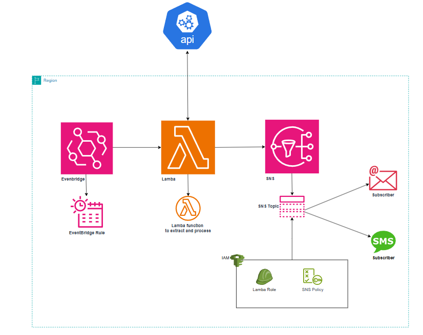

# Currency Exchange Rate Notifier

30 Day DevOps Challenge | Day 1 | DevOpsAllStarsChallenge

This project is an AWS Lambda function that fetches currency exchange rates from an external API and sends updates to an Amazon SNS topic. The function is written in Python and uses the Boto3 library for AWS service integration.

## Architecture Diagram

Below is the architecture diagram for the Currency Exchange Rate Notifier:



## Features

- Fetches the latest exchange rates for a base currency.
- Supports multiple target currencies.
- Sends formatted exchange rate updates as messages to an SNS topic.

## Files

- `currency_exchange.py`: Main Lambda function code.
- `sns_policy.json`: AWS IAM policy allowing the Lambda function to publish to the specified SNS topic.

## Prerequisites

- **Python 3.x**
- **AWS CLI** configured with appropriate credentials.
- An **SNS topic** in your AWS account.
- The `SNS_TOPIC_ARN` environment variable set with the ARN of your SNS topic.
- IAM permissions for the Lambda function to publish messages to the SNS topic (as defined in `sns_policy.json`).

## Setup

1. **Install Dependencies**:
    Ensure you have Python 3.x installed. Use the following command to install the required Python libraries:
    ```bash
    pip install boto3
    ```

2. **Configure Environment Variables**:
    Set the SNS_TOPIC_ARN environment variable with the ARN of your SNS topic. This can be done in the Lambda console or via the AWS CLI.

    Example:
    ```bash
    export SNS_TOPIC_ARN=arn:aws:sns:<region>:<account-id>:<topic-name>
    ```

3. **Deploy Lambda Function**:
    - Zip the `currency_exchange.py` file and any dependencies.
    - Deploy the zipped package to AWS Lambda and configure the function's environment variables.

4. **Attach IAM Policy**:
    Attach the IAM policy defined in `sns_policy.json` to the Lambda execution role to allow publishing to the SNS topic.

## Environment Variables

| Variable        | Description                              |
|-----------------|------------------------------------------|
| SNS_TOPIC_ARN   | ARN of the SNS topic to publish messages to |
| CURRENCY_API_KEY| API key                                  |

## How it Works

1. The function fetches the latest exchange rates for a base currency (default: USD) from the Exchange Rate API.
2. It formats exchange rates for the configured target currencies (PHP, CAD, SGD).
3. Sends each formatted rate as a message to the specified SNS topic.

## Sample IAM Policy (`sns_policy.json`)

The following IAM policy allows the Lambda function to publish to a specific SNS topic:

```json
{
     "Version": "2012-10-17",
     "Statement": [
          {
                "Effect": "Allow",
                "Action": "sns:Publish",
                "Resource": "arn:aws:sns:ap-northeast-1:039817790672:currency_exchange:b2de634a-0b36-493b-adbd-8b95fb41ab25"
          }
     ]
}
```

## Example Output

The Lambda function sends messages like this to the SNS topic:

```
Subject: Currency Exchange Rate Update
Message:
Currency Exchange Rate Update for PHP:
Exchange Rate: 55.23
```

## Troubleshooting

- **SNS_TOPIC_ARN not set**: Ensure the environment variable is correctly configured.
- **Permissions issue**: Verify the Lambda execution role has the required permissions to publish to the SNS topic.